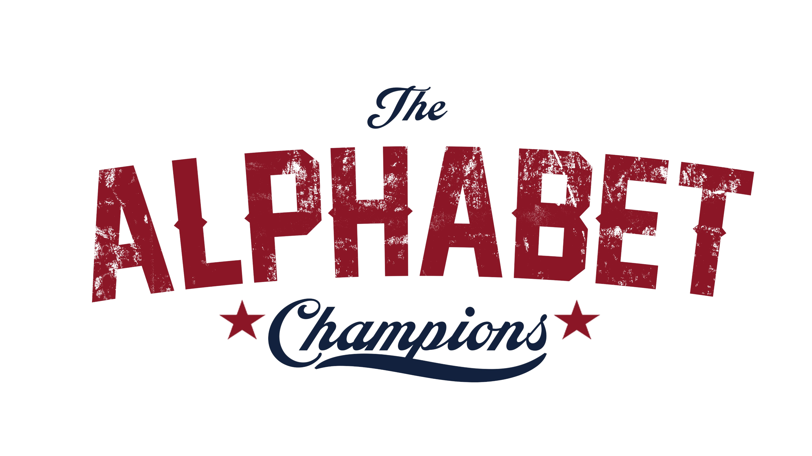

# Alphabet Champions

This is a brief analysis into the Boxing Champions of the four major boxing santioning bodies (WBA,WBC,WBO, and the IBF) also known as the 'Alphabet Soup'.

This [dataset](https://data.world/sportsvizsunday/2020-november-boxing-champions-history) contains 500,000+ rows of boxing data from 1962-2020, 
caputuring data such as:
*The champion's nationality
*Number of defenses
*Fight location 
*How long they held a title before they were dethroned

The dataset is uploaded and stored in a BigQuery database, then exported and processed in a [Jupyter notebook](https://cloud.google.com/bigquery/docs/visualize-jupyter) . The final results are exported to a xlsx workbook then vizualized in a Tableau Dashboard, which can be viewd [here](https://public.tableau.com/shared/SCN59NX9W?:display_count=n&:origin=viz_share_link).

## Requirements

* [Python 3.6](https://www.python.org/downloads/release/python-360/)
* [Jupyter Notebook](http://jupyter.org/)

## Dependencies

Choose the latest versions of any of the dependencies below:

* [pandas](https://pandas.pydata.org/)
* [numpy](http://www.numpy.org/)
* [openpyxl](https://openpyxl.readthedocs.io/en/stable/)
* [google cloud](https://cloud.google.com/python/docs/reference/storage/latest)
